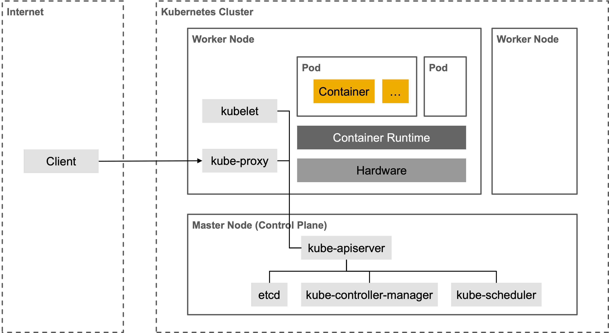

# Introduction

Kubernetes is selected as the technological basis for the implementation of a distributed platform. An overview of the structure of a Kubernetes cluster is shown in the following figure:

The Control Plane is responsible for managing the cluster and consists of the following components:
* kube-apiserver: Provides the Kubernetes API.
* etcd: Highly available key-value store used for persistent storage of cluster data.
* kube-scheduler: Manages newly configured pods and distributes this to worker nodes.
* kube-controller-manager: Responsible for monitoring nodes.

Worker nodes are installed on physical or virtual machines and consists of the following components:
* kubelet: A software agent that runs on each worker node in the cluster. This component monitors the execution of containers in a pod.
* kube-proxy: Responsible for managing network rules that allow communication from outside and inside the cluster.
* Container runtime: Responsible for the execution of containers, e.g. Docker or containerd.