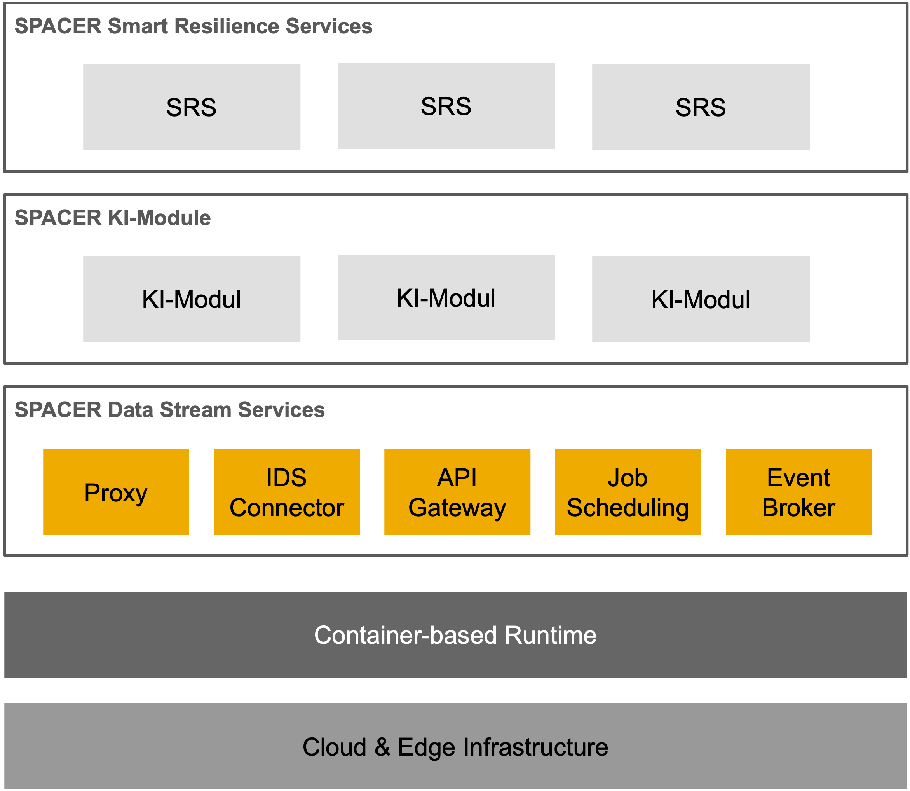
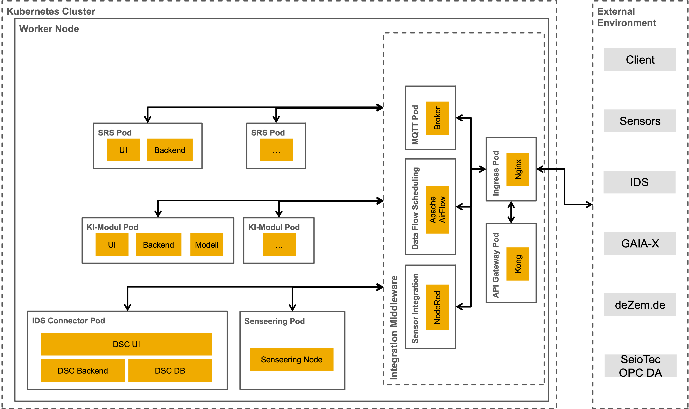

# SPAICER Platform Architecture

An overview of the structure of the SPAICER IT platform is shown in the following figure:

The design of the SPAICER IT platform based on Kubernetes is shown in the following figure:

