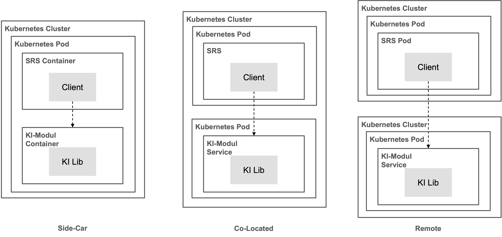

# Implementation of AI Modules

AI modules can be imported by SRS either as a library or invoked as a remote service. Alternatives for designing AI modules as libraries are shown in the following figure:

Alternatives for designing AI modules as remote services are shown in the following figure:

